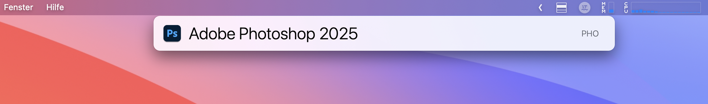

# Get Recent Adobe Documents for LaunchBar

This repository provides a suite of LaunchBar [actions](https://www.obdev.at/products/launchbar/actions.html) for accessing recent Adobe documents. The actions are designed to streamline access to recent files for users working with Adobe [Acrobat](https://www.adobe.com/acrobat.html), [Photoshop](https://www.adobe.com/products/photoshop.html), and [Illustrator](https://www.adobe.com/products/illustrator.html).



## Contents

This repository includes the following components:

- **Actions**: Pre-packaged LaunchBar actions in `Actions.zip` to enable direct access to recent documents.
- **Source Code**:
  - **BDAlias**: Helper library for managing macOS aliases.
  - **GetRecentAcrobatDocuments**: Retrieves recent Adobe Acrobat documents.
  - **GetRecentIllustratorDocuments**: Retrieves recent Adobe Illustrator documents.
  - **GetRecentPhotoshopDocuments**: Retrieves recent Adobe Photoshop documents.
  - **GetRecentAdobeDocumentsLib**: Shared library used across Adobe document retrieval actions.

## Installation

### Option 1: Manual Installation

1. **Download** the pre-packaged actions from the [Actions.zip](path/to/Actions.zip).
2. **Extract** the contents, which include:
   - `Recent Acrobat Documents.lbaction`
   - `Recent Illustrator Documents.lbaction`
   - `Recent Photoshop Documents.lbaction`
3. Place these `.lbaction` files into your LaunchBar Actions folder:
   ```
   ~/Library/Application Support/LaunchBar/Actions
   ```

4. **Restart LaunchBar** to load the new actions.

### Option 2: Automatic Installation

Alternatively, you can simply double-click each `.lbaction` file. This will automatically install the action in LaunchBar.

## Compilation Instructions

To compile the `GetRecentPhotoshopDocuments`, `GetRecentIllustratorDocuments`, and `GetRecentAcrobatDocuments` programs from the source code, follow the steps below. Compilation from the source code should however not be necessary if you simply plan to use the actions.

1. **Open the Workspace**:
   - Open the Xcode workspace `GetRecentAdobeDocuments.xcworkspace`, which is located at the root of the project directory:
   ```
   open GetRecentAdobeDocuments.xcworkspace
   ```

2. **Select the Scheme**:
   - In Xcode, use the scheme selector in the toolbar to select one of the targets:
     - `GetRecentPhotoshopDocuments`
     - `GetRecentIllustratorDocuments`
     - `GetRecentAcrobatDocuments`

3. **Set Build Configuration**:
   - Go to **Edit Scheme** for each target and ensure the **Build Configuration** is set to `Release` for the final production build.

4. **Build the Selected Target**:
   - Select **Product > Build** to build the selected scheme. This will compile the program and place the output in the `BUILT_PRODUCTS_DIR`.

5. **Repeat for Each Program**:
   - Repeat steps 2 to 4 for each program (`GetRecentPhotoshopDocuments`, `GetRecentIllustratorDocuments`, and `GetRecentAcrobatDocuments`) to produce all three executables.

6. **Manual Copy to LaunchBar Actions**:
   - After building, copy each executable to its respective directory in:
     ```
     ~/Library/Application Support/LaunchBar/Actions/Recent [Application Name] Documents.lbaction/Contents/Scripts
     ```
   - Replace `[Application Name]` with `Photoshop`, `Illustrator`, or `Acrobat` as appropriate.

## Usage

- Activate LaunchBar and type the name of the desired Adobe application.
- Use the corresponding action to view and open recent documents directly from LaunchBar.

## Donations

If you find this plugin helpful, consider supporting its development with a donation.

[](https://buymeacoffee.com/alberti)

## Author

- **Author:** Andrea Alberti
- **GitHub Profile:** [alberti42](https://github.com/alberti42)
- **Donations:** [](https://buymeacoffee.com/alberti)

Feel free to contribute to the development of this plugin or report any issues in the [GitHub repository](https://github.com/alberti42/obsidian-plugins-annotations/issues).
